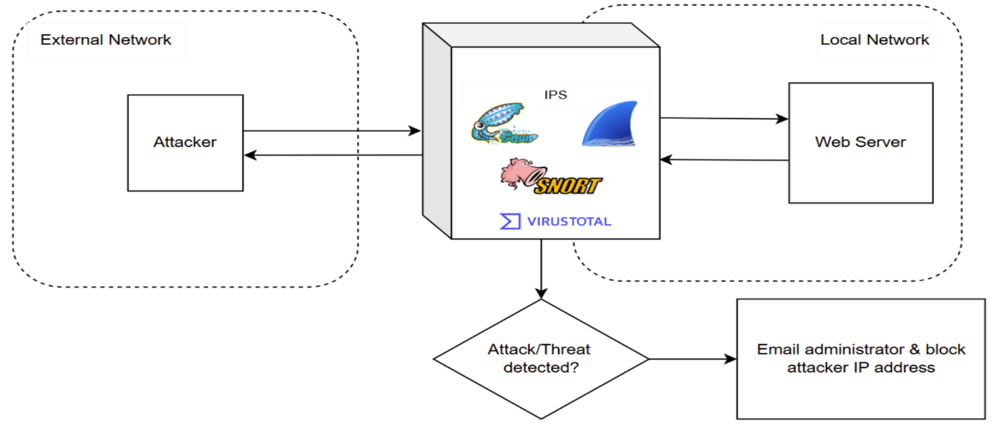
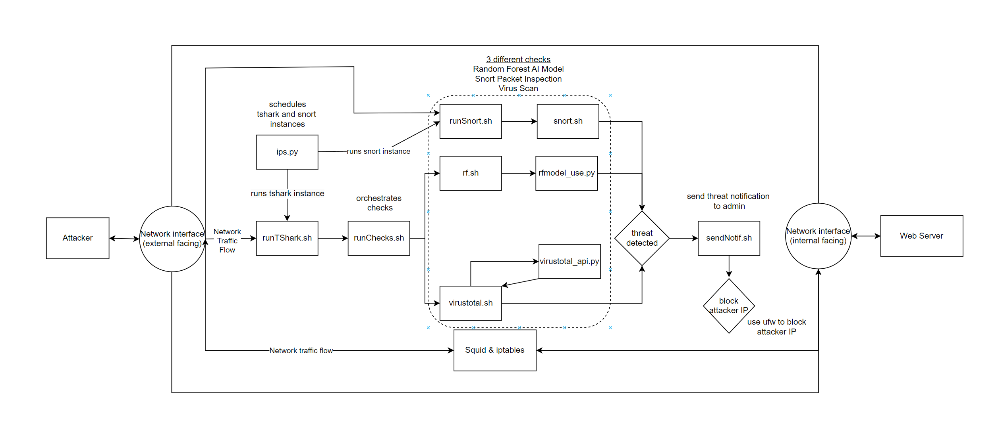

# Intrusion Detection System

## Threats to detect
<ul>
    <li>Brute Force Attacks
        <ul>
            <li>EG. Brute Force password cracking</li>
        </ul>
    </li>
    <li>SQL Injection Attacks</li>
    <li>XSS Attacks</li>
    <li>Malicious File Upload</li>
</ul>

## How we detect threats
<ul>
    <li>Random Forest ML Model
        <ul>
            <li>Detects Brute Force Attacks using Network Statistics</li>
        </ul>
    </li>
    <li>Snort
        <ul>
            <li>Detects SQLInjection + XSS by inspecting packet payloads</li>
        </ul>
    </li>
    <li>VirusTotal
        <ul>
            <li>Detects malicious file uploads</li>
        </ul>
    </li>
</ul>

## Tools used
<ul>
    <li>TShark - Monitor Network Traffic</li>
    <li>Snort - Network Packet Inspection</li>
    <li>Squid - Reverse Proxy for our Web App</li>
    <li>CICFlowMeter - Convert network traffic captured from TShark to a CSV of Network Statistics</li>
    <li>VirusTotal API</li>
    <li>CIC-IDS-2017 Dataset</li>
</ul>

## Set-Up
<ul>
    <li>Attacker (ParrotOS)</li>
    <li>IDS (Ubuntu)</li>
    <li>Server (bWAPP vulnerable web app)</li>
</ul>

## Set-Up Diagram

## IDS Architecture

